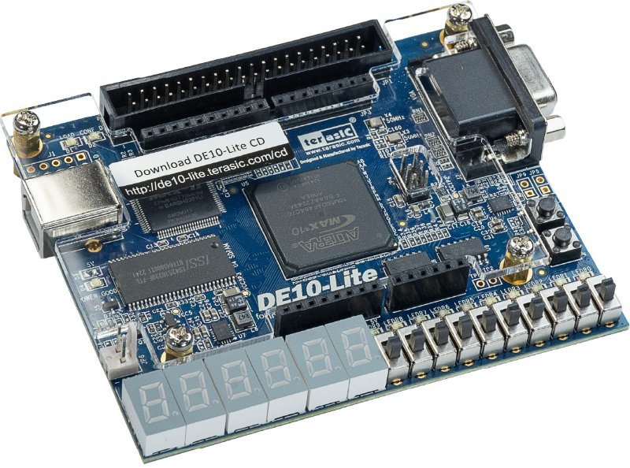
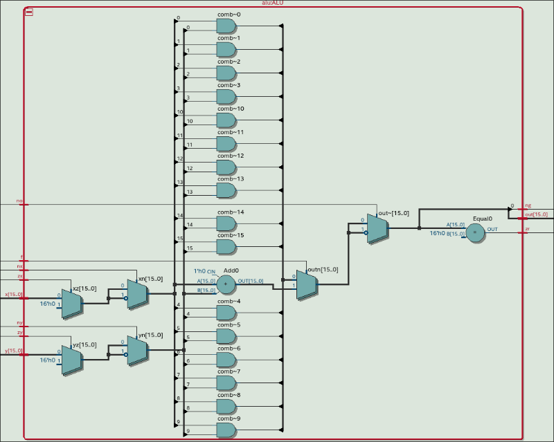
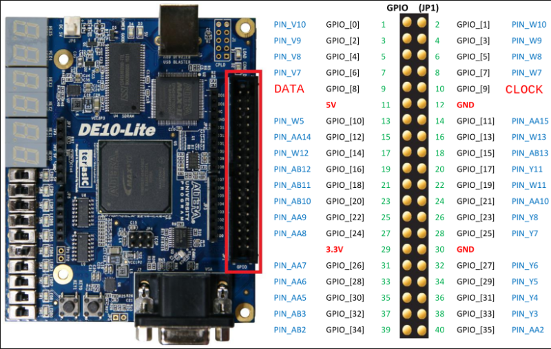

## Introduction
In this project we are going to implement the HACK computer designed in parts I and II of the [Nand2Tetris](https://www.nand2tetris.org/) course.

## Hardware
For the HACK computer itself we will be using a DE10-Lite FPGA board from Terasic. It is available for purchase from their [website](https://www.terasic.com.tw/cgi-bin/page/archive.pl?Language=English&CategoryNo=234&No=1021#contents) for around $80 along with many expansion interface, multimedia, video/imaging, networking, AD/DA, robotics boards. It is also freely available on ebay. The board is built around the Altera MAX 10 10M50DAF484C7G chip with 50,000 logic elements, 1,638 Kb of on-chip memory, 64MB of SDRAM, 2x20 GPIO interface and a VGA interface.

And for the peripherals we will need a VGA monitor with a cable and a PS/2 keyboard.

## Design

In part I of the course we designed the HACK computer using a hardware definition language designed by the authors. Now we need to implement it in a real HDL. There are 2 options to choose from: Verilog and VHDL. Which one is better is a subject of a thirty years' holy war, but if you don't already have a favourite I suggest Verilog for its shallower learning curve and simpler syntax. 

In part I we used structural design patterns to implement system logic. We chose a NAND gate as a basic building block, and then instantiated it inside higher modules to gradually create more complex functions. While this approach has its place in hardware design it isn't always the most effective. Take for example our ALU. To design it we first had to design `AND`, `OR`, `XOR` and `NOT` gates, along with their 16-bit versions. Then using these basic gates we designed a multiplexer and an 8-way `OR` gate, then tied them all together to get the required ALU functionality. Now compare all that code we had to write to the same ALU implemented in Verilog using behavioral modeling:

~~~verilog
module alu (
    input  [15:0] x,    // input x (16 bit)
    input  [15:0] y,    // input y (16 bit)
    input         zx,   // zero the x input?
    input         nx,   // negate the x input?
    input         zy,   // zero the y input?
    input         ny,   // negate the y input?
    input         f,    // compute out = x + y (if 1) or x & y (if 0)
    input         no,   // negate the out output?
    output [15:0] out,  // 16-bit output
    output        zr,   // 1 if (out == 0), 0 otherwise
    output        ng    // 1 if (out < 0),  0 otherwise
);

  wire [15:0] xz = zx ? 16'h0000 : x;
  wire [15:0] xn = nx ? ~xz : xz;
  wire [15:0] yz = zy ? 16'h0000 : y;
  wire [15:0] yn = ny ? ~yz : yz;
  wire [15:0] outn = f ? (xn + yn) : (xn & yn);

  assign out = no ? ~outn : outn;
  assign zr  = (out == 16'h0000);
  assign ng  = out[15];

endmodule
~~~

Here we implemented the same logic as before in only 8 lines of code. And now it is the synthesis tool's job to generate the most efficient hardware realisation of this function.

### Clocks

DE10 Lite comes with a 50 MHz clock. We will need to step it down to 25 MHz for our project. In Quartus Prime we have PLLs available as free IP blocks, which we can instantiate with the required parameters. If you plan to sim this project with ModelSim make sure to include `altera_mf_ver` library which contains PLL's source code. PLL has about 20 ns lag, so we will tie our reset to its output.

~~~verilog
  reg  [3:0] rst_cnt = 4'h0;
  wire       rst = ~rst_cnt[3];
  always @(negedge clk_25)
    if (~KEY[0] | ~locked) rst_cnt <= 4'h0;
    else if (rst) rst_cnt <= rst_cnt + 1;
~~~

### CPU

In order to be able to run Pong, which compiles to 50,000 instructions, we need to make one small change to our CPU design. In the original specification we distinguish A from C instruction by the first MSB only. This limits the ROM address pool to only 32,768 instructions, which isn't enough for Pong. So in our design we will make a small change. Only instructions starting with `111` are now C-instructions and everything else will be A-instructions. This way we increase the ROM address pool to 57,343 while maintaining reverse compatibility with the original design.

~~~verilog
  wire cInstr = &instruction[15:13];
~~~

### Memory

For all our memory needs we will make 3 memory blocks and a bunch of individual registers to handle IO like switches and LEDs. For instruction memory we will make a ROM module consisting of 57,344 16-bit registers. We will initialize it with our `os.hack` file.

~~~verilog
  initial $readmemb("os/os.hack", MEM);
~~~

Then we will make two separate modules for RAM and screen map. Since we have two separate modules, CPU and VGA controller, address screen map at the same time, we will make it dual-channel, read/write channel for CPU and read-only channel for VGA. 

### Video

DE10 Lite comes with a 4-bit VGA DAC and supports standard VGA resolution 640x480 at 25MHz. Since Hack OS is designed to work with 512x256 resolution we will have to add a 128x224 frame to our picture.

### Keyboard

You will need a PS/2 keyboard and a pigtail to connect it to GPIO. Connect it according to the diagram below.

| Signal | Keyboard pin | GPIO pin |
| :----: | :----------: | :------: |
| Vcc | 4 | 11 |
| GND | 3 | 12 |
| DATA | 1 | 9 |
| CLK | 5 | 10 |

### IO

You can use five new OS functions to control button `KEY1`, 10 switches `SW0` - `SW9`, 10 LEDs `LEDR0` - `LEDR9` and 6 7-digit displays `HEX0` - `HEX5`.

~~~c
class IO {
    function boolean button();
    function int sw();
    function void led(int number);
    function void seg(int number);
    function void status(int number);
}
~~~

## Compiler

If you want to use my compiler, simply run `make` command if you have `clang` and `make` already installed (if you want to use `gcc` instead simply replace `clang` with `gcc` inside `Makefile`). 

## Software

To synthesise and program our design to DE10 we will use [Quartus Prime](https://www.intel.com/content/www/us/en/collections/products/fpga/software/downloads.html) software from Intel. It has a free Lite version which is enough for our project. It also comes with a free simulation tool ModelSim. Since version 21 ModelSim was replaced with its advanced version Questa, which requires a license to run (it can be acquired for free for a year). I would recommend installing version 17 Lite, since it doesn't require any licenses to run. During installation make sure to select MAX10 Device support, Programmer, USB-Blaster drivers and ModelSim Starter Edition (if you want to be able to run simulation).

## Programming

1. Clone the project `git clone https://github.com/gunnerson/hack-fpga.git`.
2. Start Quartus Prime and create a new project. For path specify the directory from [1]. For project name type `HACK`.
3. For project type choose `Template`. Go to [Intel Design Store](https://www.intel.com/content/www/us/en/support/programmable/support-resources/design-examples/design-store.html). In search type `DE10 Lite MAX10` and download `Intel® MAX® 10 FPGA – Terasic DE10-Lite Board Baseline Pinout` template. Back in Quartus click `Install the design template` and add downloaded `*.par` file. This will create all the necessary pin assignments and global parameters for us in the `*.qsf` file.

4. Now we need to add our project files. Go to `Project -> Add/remove files`. Click `...` next to `File` field, select `top.v` and click `Open`. Repeat for all files in `v/` directory. Click `OK` to finish. 
5. In the `Project Navigator` select `Files` instead `Hierarchy`. Right-click on `top.v` and press `Set as Top-Level Entity`. You can delete `DE10_LITE_GOLDEN_TOP.v` from project files now.
6. We need to add a PLL to generate a 25 MHz clock. In the `IP Catalog` find `ALTPLL` and double-click it. Name it `pll`. For `inclk0` frequency set 50 Mhz. On the next tab uncheck `areset`. On the `Output clocks` tab for `clk c0` enter output clock frequency 25 MHz. Leave everything else default. Click `Finish` and agree to add `*.qip` file to project.
7. Go to `Assignments -> Device -> Device and Pin Options` and change configuration mode to `Single Uncompressed Image with Memory Initialization`.
8. Compile Design. Make sure it completes without errors. 
9. Open Programmer. Select `USB-Blaster` in `Hardware Setup`. Press `Start`. Wait for the progress bar to reach 100%. Device is programmed. Pong should be running on the screen. You can use the `KEY0` button to restart Hack.

